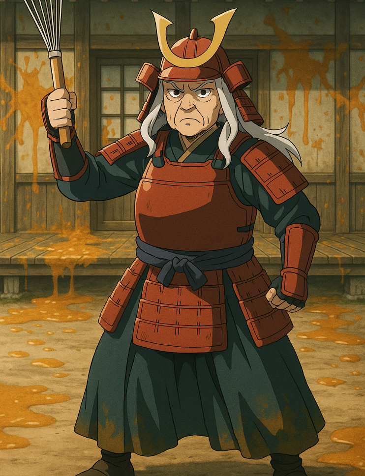
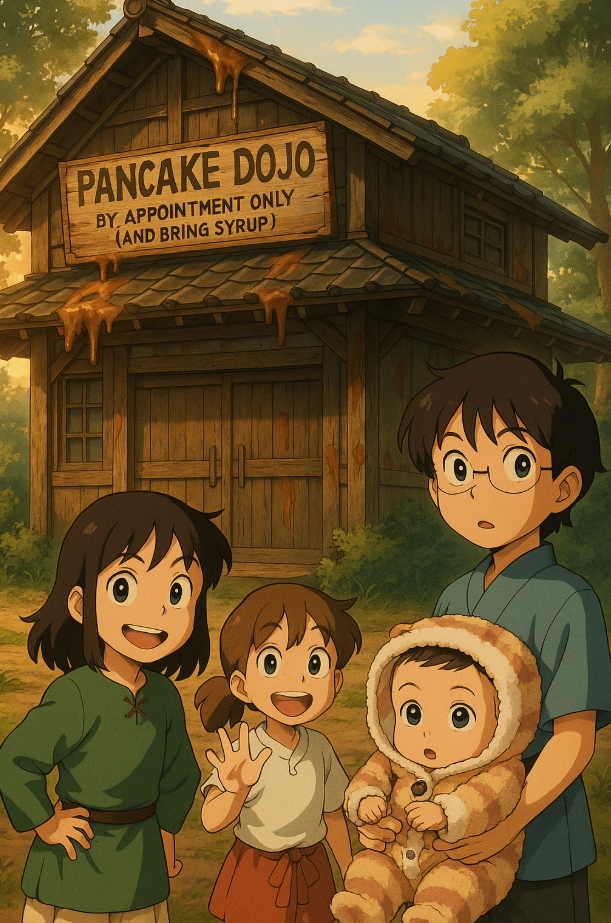
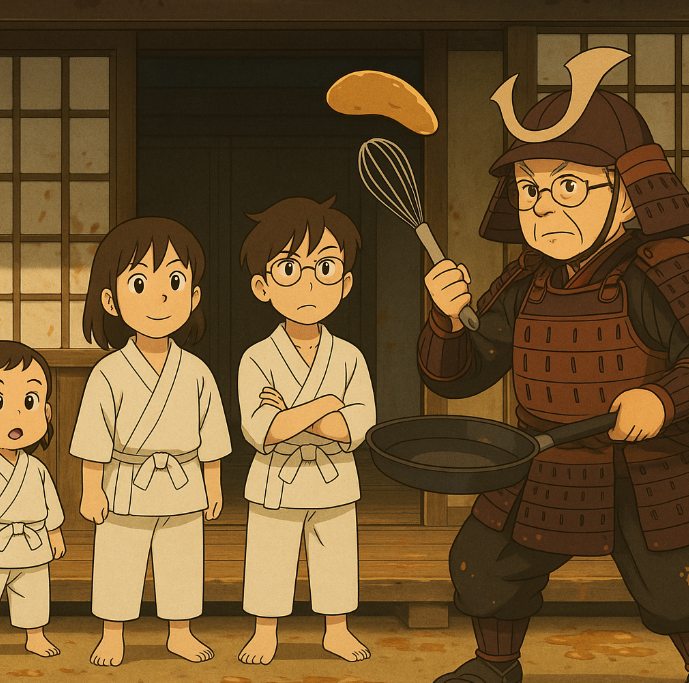
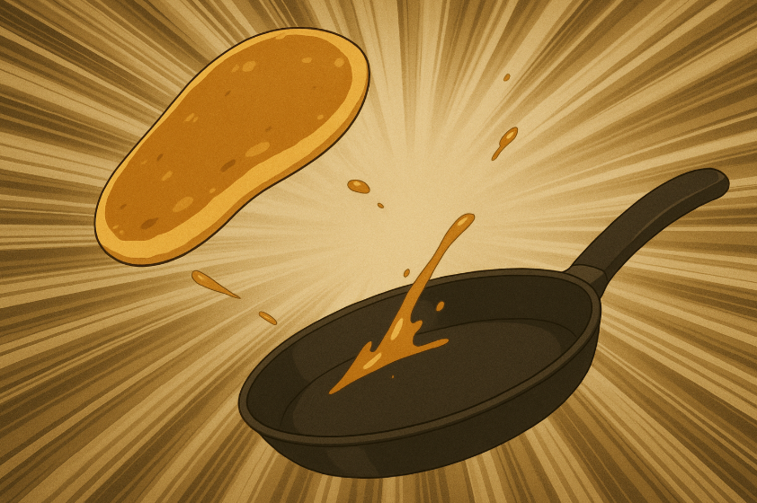

## **Episode 2: Pancake Dojo – Training Under Grandma Armstrong**

---

The Kidtama siblings stood before a mysterious wooden building at the edge of town.  
 It was old, creaky, and smelled faintly of maple syrup.  
 A faded sign read:

**PANCAKE DOJO – By Appointment Only (and Bring Syrup)**

****

The door slid open with a dramatic *whoosh.*  
 Out stepped **Grandma Armstrong**, wearing samurai armor and holding a golden whisk.

“SO\!” she boomed. “You awakened the Spoon Spirit, hmm? Then your training begins NOW\!”

“Wait,” Ezra said, “you knew about the Spoon Spirit?”

Grandma’s eyes gleamed. “Knew him? I *spoon-fed* that spirit when he was a teaspoon\!”

Evi blinked. “I… don’t know how to respond to that.”

Satey muttered, “I do. With therapy.”

---

Inside, the dojo was filled with cooking stations, spinning spatulas, and hanging pots.  
 At the center, the Spoon Spirit floated like a mystical instructor.

“Welcome, students,” it intoned. “Today, you learn the first art: *The Perfect Flip.*”

Emi raised her hand. “Uh, like flipping pancakes?”

“Exactly,” said Grandma Armstrong. “But if your pancake lands on the floor… YOU REPEAT THE DOJO CLEANING MANTRA\!”

The kids gulped. “What’s the mantra?”

She smiled. “*Wax on… syrup off.*”

---

The training began.

Ezra studied the angle of each flip, muttering equations under his breath.

 Evi used brute force — her pancakes ricocheted off the walls like frisbees.

 Emi tried to make it look cool, spinning her sword and spatula together.

 Eli just giggled and made tiny batter splats that looked suspiciously like hearts.

Satey supervised from the corner.  
 “You’re all doomed,” he said cheerfully.

---

After hours of chaos, one pancake flipped perfectly — high, golden, graceful.

 It landed right in the pan with a soft *pffft.*

Grandma Armstrong gasped. “Who… who achieved the Legendary Flip?”

Everyone pointed at Eli. The baby waved her tiny spatula. “Gee\!”

The Spoon Spirit’s eyes glowed in approval.

 “The baby has awakened the *Batter Within.* The Breakfast Arts are strong in her.”

---

As the family packed up their gear, Grandma Armstrong handed Emi a scroll.

 “Take this. The map to the next sacred art: *The Omelette of Truth.*”

Satey groaned. “Can’t we just… buy cereal instead?”

Grandma’s whisk glowed. “SILENCE, CAT.”

Evi saluted. “Yes, ma’am.”

Ezra adjusted his glasses. “Then it’s settled. Tomorrow, we begin Operation: Omelette.”

Eli raised her tiny fist in the air. “Gee\!”